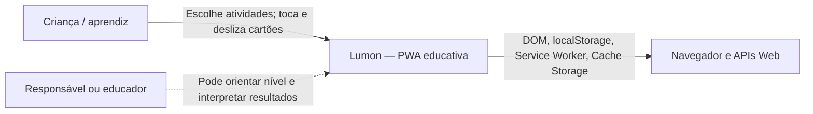
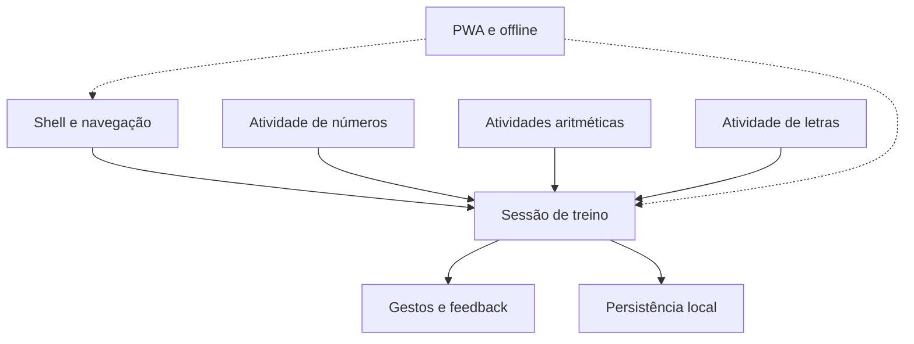
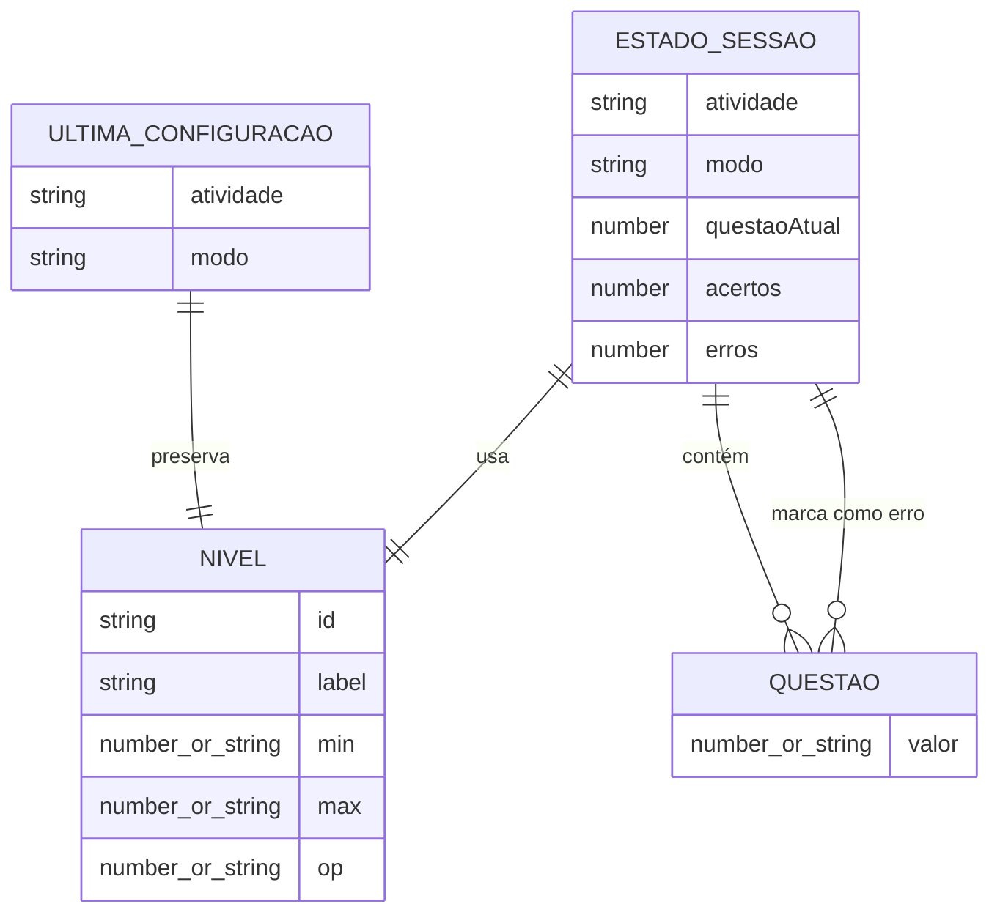

# Arquitetura do sistema — Lumon

> Síntese do Arquiteto · nível Essencial · 2026-07-17.

## Resumo executivo

🟢 **CONFIRMADO** — O Lumon é uma Progressive Web App estática e client-side. Todo o comportamento funcional é executado no navegador; não há backend, banco de dados, autenticação, API externa, fila ou processo de build.

🟢 **CONFIRMADO** — A arquitetura física possui um único container de aplicação entregue como arquivos estáticos. A separação funcional existe apenas dentro de `script.js`, por objetos, funções e listeners.

🟡 **INFERIDO** — O projeto parece destinado a hospedagem sob o caminho `/Lumon/`, provavelmente em GitHub Pages, mas não há configuração de deployment versionada que confirme o provedor.

## C4 — Contexto

- 🟢 A criança é o usuário diretamente representado pela interação do código.
- 🟡 O papel de responsável/educador é inferido pelo domínio infantil; não há fluxo dedicado no sistema.
- 🟢 O navegador fornece todas as capacidades de plataforma.
- 🟢 Não existem sistemas de negócio externos.

## Containers e elementos de execução

Embora o nível Essencial não exija um diagrama C4 de containers separado, o sistema pode ser decomposto assim:

| Elemento | Tecnologia | Responsabilidade |
|---|---|---|
| Documento da aplicação | HTML5 (`index.htm`) | Declarar as nove telas, controles e cartões |
| Aplicação cliente | JavaScript puro (`script.js`) | Estado, navegação, geração, sessão, gestos e persistência |
| Apresentação | CSS (`style.css`) | Layout mobile-first, identidade visual, animações e feedback |
| Manifesto | Web App Manifest | Metadados de instalação e execução standalone |
| Worker offline | Service Worker | Pré-cache, cache-first e limpeza de versões antigas |
| Armazenamento | `localStorage` | Última configuração de jogo |
| Cache | Cache Storage | Shell estático e imagens de feedback |

## Componentes lógicos

### Responsabilidades

- `shell-navigation`: controla a tela visível e o funil atividade → modo → nível.
- `training-session`: é o núcleo de aplicação; possui fila, progressão, resultados e retreino.
- `numbers-activity`, `arithmetic-activities`, `letters-activity`: fornecem algoritmos geradores de questões.
- `gestures-feedback`: converte a interação em autoavaliação e progressão.
- `local-persistence`: oferece conveniência entre visitas.
- `pwa-offline`: viabiliza instalação e disponibilidade do shell sem rede.

## Modelo de dados conceitual

Não existe modelo persistente relacional; portanto, não há ERD de banco. O modelo em memória pode ser representado por:

O diagrama é conceitual: objetos não têm IDs, chaves ou relacionamentos persistentes.

## Integrações e protocolos

| Integração | Direção | Protocolo/formato | Situação |
|---|---|---|---|
| DOM do navegador | Interna | APIs JavaScript | 🟢 Confirmada |
| `localStorage` | Interna | JSON | 🟢 Confirmada |
| Service Worker | Interna | Worker events | 🟢 Confirmada |
| Cache Storage | Interna | Request/Response | 🟢 Confirmada |
| Rede do host estático | Saída condicional | HTTP(S) via `fetch` | 🟢 Confirmada |
| API externa de negócio | — | — | Ausente |

## Impactos entre componentes

No nível Essencial, a matriz separada não é gerada. Principais impactos:

| Mudança | Componentes afetados |
|---|---|
| Adicionar atividade | navegação, configuração de níveis, geração de questões, estilos e cache offline |
| Alterar formato de nível | gerador da atividade, persistência e atalho de último jogo |
| Alterar avaliação | gestos/feedback, sessão, resumo e retreino |
| Alterar limite de questões | geradores, sessão e expectativas pedagógicas |
| Alterar caminhos/arquivos | HTML, manifesto, registro do worker e lista de pré-cache |
| Alterar estrutura do estado | sessão, reset, persistência e todos os listeners |

## Dívidas técnicas

### Prioridade alta

1. 🟢 **Código sem testes:** regras pedagógicas, gestos e offline não possuem cobertura automatizada.
2. 🟢 **Monólito JavaScript:** `script.js` concentra oito responsabilidades em 457 linhas e compartilha estado mutável.
3. 🟢 **Uso de `eval()`:** respostas aritméticas são calculadas por avaliação dinâmica de string.
4. 🟢 **Caminhos inconsistentes:** worker usa `/Lumon/service-worker.js`, imagens pré-cache usam `/images/...`, enquanto manifesto e HTML contêm caminhos relativos.

### Prioridade média

5. 🟢 Embaralhamento por `sort(Math.random)` é enviesado e difícil de testar.
6. 🟡 O clique pode alternar o cartão duas vezes por sobreposição entre `handleDragEnd` e listener `click`.
7. 🟢 `JSON.parse` do armazenamento local não trata dados inválidos.
8. 🟢 O service worker usa cache-first indefinidamente, não grava respostas de rede e pode apagar caches alheios da mesma origem.
9. 🟢 Níveis “Até 20/30” sequenciais são truncados nos primeiros 15 itens.

### Qualidade e evolução

10. 🟢 Não há módulos, tipos formais, linter, formatter, pipeline CI/CD ou versionamento semântico do app.
11. 🟢 Acessibilidade por teclado, foco e leitor de tela não está implementada de forma explícita.
12. 🔴 Requisitos pedagógicos e compatibilidade de navegadores não estão formalizados.

## Restrições arquiteturais observadas

- O sistema precisa funcionar sem backend.
- O estado da sessão é efêmero e vive em memória.
- Persistência local contém apenas preferências do último jogo.
- Experiência central pressupõe ponteiro ou toque horizontal.
- Service Worker requer contexto seguro e escopo compatível.

## Direção recomendada para evolução

🟡 Preservando a arquitetura estática, o primeiro passo seguro seria extrair módulos JavaScript por responsabilidade, substituir `eval()` por cálculo explícito, tornar geradores determinísticos/testáveis e criar testes unitários e E2E. Essas são recomendações, não requisitos confirmados do legado.
