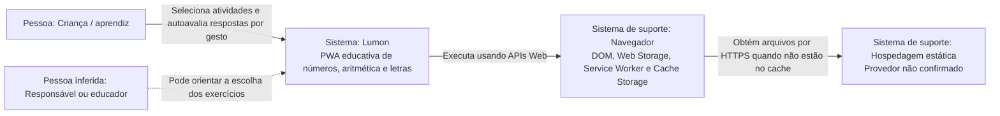

# C4 — Contexto do Lumon

> Diagrama de contexto gerado pelo Arquiteto.

## Relações

| Origem | Destino | Relação | Confiança |
|---|---|---|---|
| Criança | Lumon | Executa treinos e marca acerto/erro | 🟢 |
| Responsável/educador | Lumon | Orienta uso | 🟡 |
| Lumon | Navegador | Usa APIs nativas e armazenamento local | 🟢 |
| Navegador | Hospedagem estática | Baixa shell e assets por HTTP(S) | 🟢 |
| Lumon | Serviços externos | Nenhuma integração identificada | 🟢 |

## Fronteira do sistema

Dentro da fronteira do Lumon estão HTML, CSS, JavaScript, manifesto e service worker. Navegador, armazenamento/cache implementados pelo navegador e hospedagem dos arquivos são dependências de plataforma externas à base de código.
